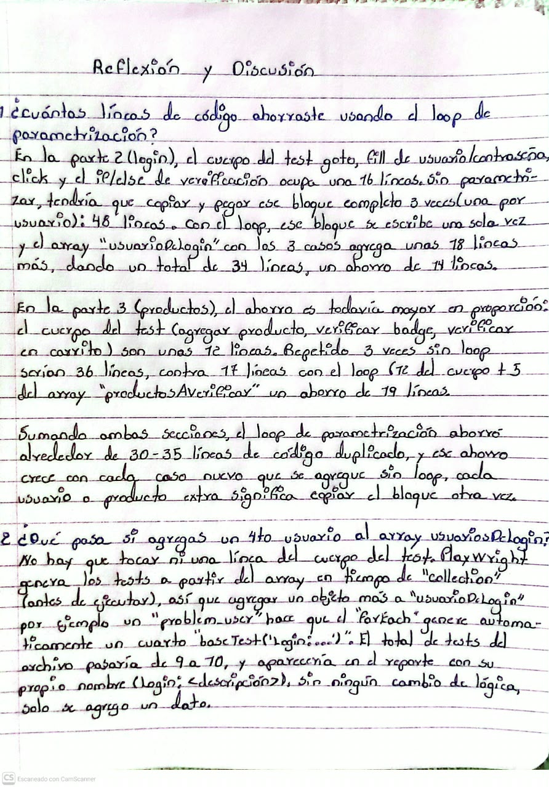
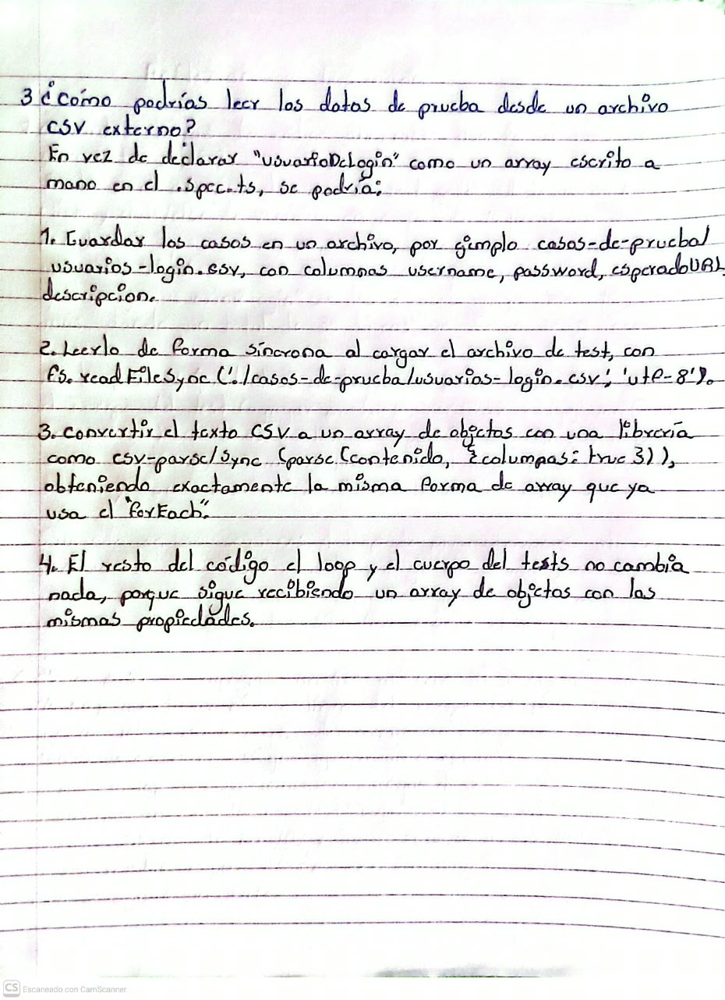

Reflexión y Discusión — Clase 9

Curso 048 · Aseguramiento de la Calidad del Software · Clase 9 Proyecto: PW-2026 (Playwright + TypeScript)

Evidencia del ejercicio

Transcripción

Con los 9 tests corriendo en verde. Comando usado: npx playwright test tests/clase09.spec.ts --reporter=list

1. ¿Cuántas líneas de código ahorraste usando el loop de parametrización?

En la Parte 2 (login), el cuerpo del test —goto, fill de usuario/contraseña, click y el if/else de verificación— ocupa unas 16 líneas. Sin parametrizar, tendría que copiar y pegar ese bloque completo 3 veces (una por usuario): 48 líneas. Con el loop, ese bloque se escribe una sola vez y el array usuariosDeLogin con los 3 casos agrega unas 18 líneas más, dando un total de ~34 líneas: un ahorro de ~14 líneas.

En la Parte 3 (productos), el ahorro es todavía mayor en proporción: el cuerpo del test (agregar producto, verificar badge, verificar en carrito) son unas 12 líneas. Repetido 3 veces sin loop serían 36 líneas, contra ~17 líneas con el loop (12 del cuerpo + 5 del array productosAVerificar): un ahorro de ~19 líneas.

Sumando ambas secciones, el loop de parametrización ahorró alrededor de 30-35 líneas de código duplicado, y ese ahorro crece con cada caso nuevo que se agregue — sin loop, cada usuario o producto extra significa copiar el bloque completo otra vez.

2. ¿Qué pasa si agregas un 4to usuario al array usuariosDeLogin?

No hay que tocar ni una línea del cuerpo del test. Playwright genera los tests a partir del array en tiempo de "collection" (antes de ejecutar), así que agregar un objeto más a usuariosDeLogin —por ejemplo un problem_user— hace que el forEach genere automáticamente un cuarto baseTest('Login: ...'). El total de tests del archivo pasaría de 9 a 10, y aparecería en el reporte con su propio nombre (Login: <descripción>), sin ningún cambio de lógica: solo se agregó un dato.

3. ¿Cómo podrías leer los datos de prueba desde un archivo CSV externo?

En vez de declarar usuariosDeLogin como un array escrito a mano en el .spec.ts, se podría:

Guardar los casos en un archivo, por ejemplo casos-de-prueba/usuarios-login.csv, con columnas username,password,esperadoURL,descripcion.
Leerlo de forma síncrona al cargar el archivo de test, con fs.readFileSync('./casos-de-prueba/usuarios-login.csv', 'utf-8').
Convertir el texto CSV a un array de objetos con una librería como csv-parse/sync (parse(contenido, { columns: true })), obteniendo exactamente la misma forma de array que ya usa el forEach.
El resto del código —el loop y el cuerpo del test— no cambia nada, porque sigue recibiendo un array de objetos con las mismas propiedades.