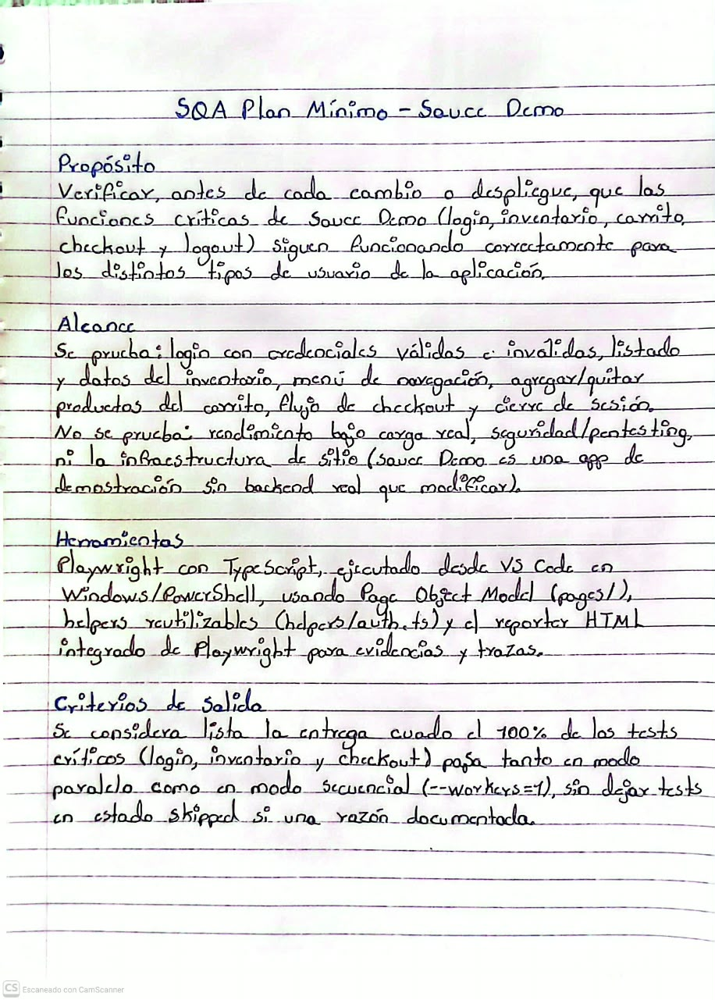

SQA Plan mínimo — Sauce Demo

Curso 048 · Aseguramiento de la Calidad del Software · Clase 8 Proyecto: PW-2026 (Playwright + TypeScript)

Evidencia del ejercicio 
   

Transcripción

Propósito

Verificar, antes de cada cambio o despliegue, que las funciones críticas de Sauce Demo (login, inventario, carrito, checkout y logout) siguen funcionando correctamente para los distintos tipos de usuario de la aplicación.

Alcance

Se prueba: login con credenciales válidas e inválidas, listado y datos del inventario, menú de navegación, agregar/quitar productos del carrito, flujo de checkout y cierre de sesión. No se prueba: rendimiento bajo carga real, seguridad/pentesting, ni la infraestructura del sitio (Sauce Demo es una app de demostración sin backend real que modificar).

Herramientas

Playwright con TypeScript, ejecutado desde VS Code en Windows/PowerShell, usando Page Object Model (pages/), helpers reutilizables (helpers/auth.ts) y el reporter HTML integrado de Playwright para evidencias y trazas.

Criterios de salida

Se considera lista la entrega cuando el 100% de los tests críticos (login, inventario y checkout) pasa tanto en modo paralelo como en modo secuencial (--workers=1), sin dejar tests en estado skipped sin una razón documentada.